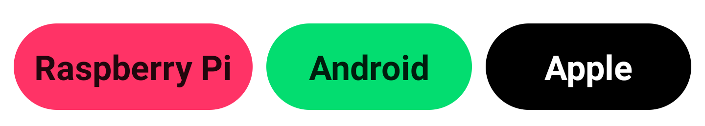

<h1 align = "center">
    Cobadge
</h1>

<p align = "center">
    <a target="__blank" rel="noopener noreferrer"  href="https://jitpack.io/#michaelgrigoryan25/cobadge"></a>
    <a href="#"></a>
    <a href="#"></a>
</p>

<p align = "center">
    <a href="#"></a>
</p>

<p style = "margin-bottom: 5%" align = "center">🗻 Unopinionated, easy-to-use, and customizable Badge component for Jetpack Compose</p>

# Getting started

In this section I will walk you through the steps to add Cobadge to your Android app.

### Add the JitPack repository to your build file

Add this line at the end of `repositories`:

```groovy
maven { url 'https://jitpack.io' }
```

If your project is set to fail on project repositories, then add that line to `settings.gradle` file in `repositories` field, so that it looks approximately like this

```groovy
dependencyResolutionManagement {
    repositoriesMode.set(RepositoriesMode.FAIL_ON_PROJECT_REPOS)
    repositories {
        google()
        mavenCentral()
        maven { url 'https://jitpack.io' }
    }
}
rootProject.name = "Your application"
```

### Add the dependency and replace `Tag` with the latest version.

Latest version is indicated below:

[](https://jitpack.io/#michaelgrigoryan25/cobadge)

Groovy

```groovy
implementation 'com.github.michaelgrigoryan25:cobadge:Tag'
```

Kotlin DSL

```kotlin
implementation("com.github.michaelgrigoryan25:cobadge:Tag")
```

# Usage

Using Cobadge is really easy! Here's an example:

```kotlin
Badge(
    color = Color200,
    text = "Hello World"
)
```

Here are all the options that Cobadge takes. Fortunately, most of them are optional.

```kotlin
// Badge text
text: String,
// Badge background color
color: Color,
// Badge size (calculated automatically)
size: Size = Size.MD,
// Outer badge padding
paddingSelf: Dp = 4.dp,
// Supports clicking
isClickable: Boolean = true,
// Badge rounding (calculated automatically)
rounded: Rounding = Rounding.XL,
// Badge background color transparency
backgroundColorOpacity: Float = 1f,
// Badge text color
textColor: Color = Color.Unspecified,
// Action that is going to get triggered on click
onClickAction: () -> Unit = {},
// Badge text font weight
fontWeight: FontWeight = FontWeight.Bold
```

# Contributions

Contributions to Cobadge are welcome! Saw a bug? [Create a pull request!](https://github.com/michaelgrigoryan25/cobadge/issues/new) Have a suggestion? [Create an issue](https://github.com/michaelgrigoryan25/cobadge/issues/new) or [start a discussion!](https://github.com/michaelgrigoryan25/cobadge/discussions/new)

_Author: Michael Grigoryan_
